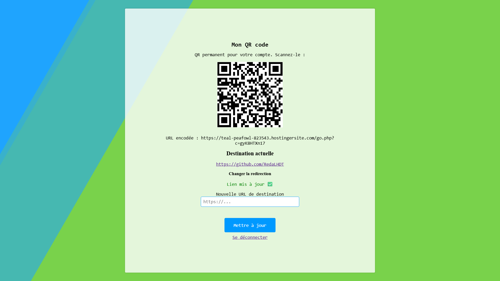
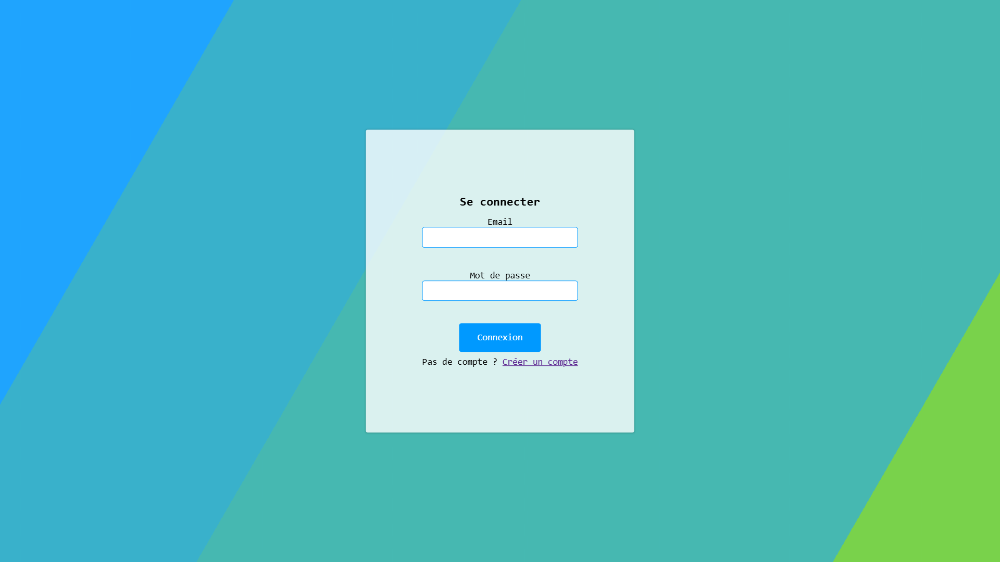
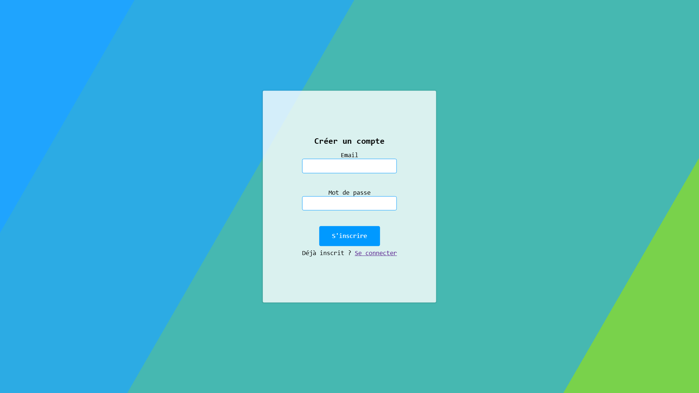

# 🎯 myQR-Code

**myQR-Code** est une application web permettant à chaque utilisateur de générer un QR code personnel, permanent, lié à une URL redirigeable.

---

## 🔑 Fonctionnalités principales

- ✅ Génération d’un QR unique pour chaque compte
- 🔄 Redirection personnalisée vers une URL définie
- 🔐 Connexion par compte utilisateur (email + mot de passe)
- 🧠 Sauvegarde des données dans une base MySQL
- 📱 QR scannable vers une page dynamique

---

## 🖼️ Aperçu de l'interface

| Dashboard | Connexion | Créer un compte |
|----------|-----------|----------- |
|  |  |  |

---

## 🌐 Démo en ligne

👉 [Accéder à la démo](https://teal-peafowl-823543.hostingersite.com/register) *(lecture seule)*

---

## 🚧 À propos du code

Le code complet (backend, base de données, logique de redirection) n’est pas inclus dans ce dépôt public pour des raisons de sécurité.

---

## 🛠️ Technologies utilisées

- HTML / CSS / JS
- PHP
- MySQL
- Librairie QRCode

---

## 📬 Contact

Pour en savoir plus ou discuter du projet, contactez-moi via GitHub.

